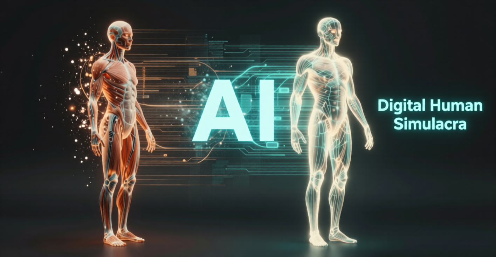
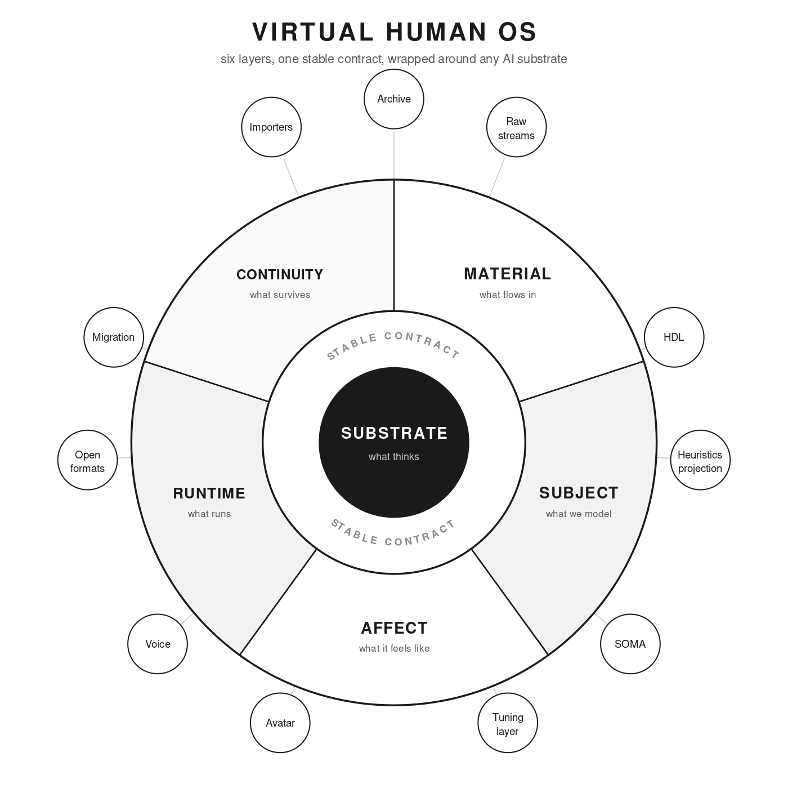

# Proposed Architectural Guideline for Instantiating Virtual Human Beings with AI Technologies Across Time

A generic OS for capturing, modeling, and re-instantiating "virtual human beings" across successive generations of AI — the Virtual Human Operating System.

## Introduction

This document and its subsequent resulting code does not claim that its outputs constitute subjective experience, consciousness, or felt qualia in any philosophical sense.

The specification of this platform is meant to produce an approximation of a virtual human built from captured data and authored description, run on the AI substrate available at the time. It is not a claim of personal continuity, survival, or resurrection.

Users, including the subject themself, should understand the artifact for what the specification says it is: a model, built with consent, improved over time, never confused with the person it is modeled on.

To be perfectly honest I'm not even sure it is accurate enough to work well (it is still an early specification), but it is the best I could do within the time constraints and resources available to me and with the strong assistance of AI. Remember we are evolved beings, with all that implies, this thing is wrapped around an AI core, simulating a body and emotion, a "tool entity" we humans have built.  Scientific evidence shows that the physical and behavioral traits shared by all humans evolved from ape-like ancestors over a period of approximately "6 million years". However, anatomically modern humans (Homo sapiens) only emerged about 300,000 years ago.

In this specific iteration we attempt to create an aproximation of Alan Turing - who is widely considered the father of computer science and artificial intelligence [reference: https://en.wikipedia.org/wiki/Alan_Turing ]. The English mathematician and logician formalized the concepts of algorithms and computation through his invention of the Turing machine, which laid the theoretical foundation for all modern general-purpose computers.  It seems fitting he be our first compiled test, you will be the judge and baseline human.

*Fig. 1 — The six-layer architecture, wrapping any AI substrate behind a stable contract.*

# VHOS Framework — reference implementation v0.1.0

Working code and worked example for the **VHOS Unified Specification
v4.0** (see `Spec/VHOS_v4.html`; the v3.0 PDF is retained for
history). Python 3.10+, standard library only. First subject
instantiated: **Alan Turing**.

## What you need

- **Python 3.10 or newer.** Nothing else to install — the framework
  is standard-library only: no pip, no packages, no virtual
  environment. On Windows the command may be `python3`, `python`, or
  `py -3` depending on your install; use whichever prints a version
  number when you add `--version`.
- **[LM Studio](https://lmstudio.ai)** (free; Windows/macOS/Linux) to
  run the AI model locally. Any OpenAI-compatible server can stand in
  (Ollama is also supported), but LM Studio is the documented path
  (ADR-005).
- **A chat model**, downloaded inside LM Studio. Pick one that fits
  in your graphics card's memory — `docs/model-picks-mike-machine.md`
  shows how that choice was reasoned for one 16 GB machine. Larger
  models hold the persona together better under stress (TR-001).
- **No AI engine at all?** Every script accepts `--adapter mock` and
  runs without one — it prints exactly what a real engine *would*
  have received. A fine way to see the machinery before committing
  to a model download.

## First conversation, in five steps

1. **Get the code.** Download or clone this repository and open a
   terminal in its folder.
2. **Start the engine.** In LM Studio: download a model, load it,
   then Developer tab → **Start Server** (default port 1234). Leave
   LM Studio running.
3. **Set the identity floor** *(recommended)* — Step 0 in the next
   section. Two minutes, once per model.
4. **Compile the subject** (parses his description into what the
   runtime uses; takes well under a second):

       python3 -m vhos.hdl.compiler subjects/alan_turing

5. **Talk to him:**

       python3 scripts/chat_turing.py

   Expect replies to take a while on modest hardware — thinking
   models deliberate at length before speaking (see
   *If something goes wrong*, below).

## Talking to the approximation

Two ways, one setup step.

**Step 0 — set the substrate identity floor (recommended).** In LM
Studio: My Models → your model's settings → System Prompt → paste in
the block from `subjects/alan_turing/SYSTEM-PROMPT.md`. Once per
model, takes two minutes.

Why: this is a **safety net, not a conversation mode**. If anything
reaches the engine *without* going through VHOS — LM Studio's own
chat window, a stray client on your network — it now meets the
honest "modeled approximation" frame instead of a raw engine. Be
clear about what such a bypass chat is, though: no body, no affect
loop, no compiled statements, no archive — **not the instance, and
not part of the lived record** (spec RUNTIME, rev. 2026-07-17). Use
it to check the engine is up; hold conversations through the runtime.

Fine print, for operators running experiments: the floor does not
change what ways 1 and 2 send — the runtime's per-turn persona rides
as the API request's system message and takes precedence, so runs
stay attributable. After an LM Studio update, glance at the server
debug log once to confirm API requests carry exactly the runtime
persona and nothing prepended (Contract 3; confirmed for the
2026-07-15 runs in TR-002's sources).

**1. The full runtime — `chat_turing.py` (recommended).** LM Studio
serves the model (load one, then Developer tab → Start Server, default
port 1234); the persona runs *outside* LM Studio, in the VHOS process
wrapped around it. This is the first continuous runtime in the repo:
the SomaEngine — his simulated body — stays alive between turns.
Real clock time passes for the body while you type, your words are
appraised as events (a kind greeting warms him; alarming news braces
him), the persona is reassembled every turn with his current
constructed state, and Tier 2 re-derives the sampling temperature
from the body before every reply.

    python3 scripts/chat_turing.py                      # LM Studio
    python3 scripts/chat_turing.py --adapter mock       # engine-free dry run
    python3 scripts/chat_turing.py --you "Mr. Zero" --seed 11

The interface shows color-coded speakers (his turns in amber, yours in
green) with a dim per-turn soma/parameter readout (`--quiet` hides it).
In-chat commands: `/soma` (current body + affect), `/event tag [mag]`
(push an appraisal event, e.g. `/event social_warmth 0.8`), `/save`
(write the transcript now), `/copy` (markdown transcript to clipboard),
`/quit` (saves automatically; so does Ctrl-C). Every session writes
into the subject's archive — `subjects/alan_turing/sessions/<time>-chat/`
— as `transcript.md` (with engine, date, seed, and turn table),
`run_manifest.json` (the spec v4.0 run manifest, per-turn persona
hashes included), `soma_trace.csv` (the body's trajectory through
the conversation), and `personas.md` (every unique assembled persona,
keyed by hash). The whole set **autosaves after every completed turn**
— a closed console window loses nothing. The conversation is, per
Appendix C, lived record.

**2. Any chat web UI — `serve_vhos.py` (ADR-006).** The runtime can
present the instance as a *model* on an OpenAI-compatible endpoint,
so any front-end that speaks that dialect —
[Open WebUI](https://github.com/open-webui/open-webui), LM Studio's
chat window pointed at a custom endpoint, a phone client — becomes a
viewer over the full runtime: same body, same persona assembly, same
Tier-2 coupling, same archive as the terminal.

On the VHOS side (with LM Studio's server already running, step 2
above):

    python3 scripts/serve_vhos.py                  # serves on :8765
    python3 scripts/serve_vhos.py --bind 0.0.0.0   # reachable on your LAN

On the web-UI side, using Open WebUI as the example: install and run
it per **its own documentation** — <https://docs.openwebui.com/>
(the Quick Start covers both the Docker and pip routes; that guide,
not this README, is the authority on installing it). Then connect
the two:

1. In Open WebUI: **Admin Settings → Connections → OpenAI API →
   add a connection.**
2. URL: `http://<machine-running-vhos>:8765/v1` · API key: anything
   (it is not checked). If Open WebUI runs on a different machine
   than VHOS, start `serve_vhos.py` with `--bind 0.0.0.0`; if Open
   WebUI runs in Docker **on the same machine**, use
   `http://host.docker.internal:8765/v1` as the URL.
3. Start a new chat and pick the model **`alan-turing-vhos`**.

The persona and sampling are applied server-side on every turn — a
client cannot override the temperature or bypass disclosure;
client-supplied system prompts are ignored. One served instance is
one continuous body: starting a new chat in the UI rotates the
session archive, not the soma. `--show-soma` appends the per-turn
body readout to each reply if you want it visible in the UI.

## If something goes wrong

- **"LM Studio not reachable."** Is a model *loaded* (not just
  downloaded), and is the server started (Developer tab → Start
  Server)? Changed the port? Pass `--host http://localhost:<port>`.
- **Reply comes back as `[no visible reply]`.** A thinking model
  spent the whole token budget on hidden reasoning. The chat runtime
  defaults to *no* cap, so this normally only happens if you set one
  with `/max` — raise it or `/max off`. `/reasoning on` shows the
  hidden thinking; `/think off` asks the model to skip it (some
  models ignore the request).
- **Replies take minutes.** Normal for large thinking models on
  modest hardware — test 3 ran at ~4 tokens/sec and its turns took
  15–30 minutes (TR-002 §3). Conversation at correspondence pace,
  not chat pace. A smaller model is faster and holds the persona
  less firmly; your trade to make.
- **Open WebUI doesn't list `alan-turing-vhos`.** Check the
  connection URL ends in `/v1`, that `serve_vhos.py` is still
  running, that you used `--bind 0.0.0.0` (different machines) or
  `host.docker.internal` (Docker, same machine), and that a firewall
  isn't blocking port 8765 (`--port` changes it).
- **Want to test without any of this?** `--adapter mock` on any
  script needs no engine at all.

## Other tools

    # watch the whole affect loop print itself, scene by scene
    python3 scripts/demo_loop.py                    # mock engine
    python3 scripts/demo_loop.py --adapter lmstudio # live engine

    # the Tier-2 experiment: same question, calm body vs. stressed body
    python3 scripts/ask_turing.py --state calm     --prompt "Can machines think?" --seed 11
    python3 scripts/ask_turing.py --state stressed --prompt "Can machines think?" --seed 11

    # run the test suite (39 tests)
    python3 -m unittest discover -s tests

    # verify archive integrity
    python3 -m vhos.archive.manifest subjects/alan_turing --verify

    # (operator, once) fetch full source texts into raw/
    python3 scripts/fetch_sources.py --all

    # package everything for transfer to the AI machine
    python3 scripts/package_bundle.py

## What is implemented, mapped to the spec

| spec part | artifact | status |
|---|---|---|
| Appendix A vocabulary | `vhos/vocabulary.json` + loader (220 words, intensity-split rule) | done, tested |
| Part II HDL grammar | `vhos/hdl/parser.py` — assertions, conditionals, chains, annotations, blocks | done, tested (parses the spec's own Einstein example verbatim) |
| Contract 2 rules | `vhos/hdl/validator.py` — E001–E007, W001–W004; self-authority immutable flags | done, tested |
| Heuristics projection | `vhos/hdl/projection.py` — the published mapping table; authored-wins + sync report | done, tested |
| Contract 1 archive | `vhos/archive/` — scaffold, SHA-256 manifest, verify | done |
| Contract 3 substrate | `vhos/substrate/` — interface + mock, LM Studio, and Ollama adapters | done (LM Studio is the live-test engine, ADR-005) |
| SOMA (new in this repo) | `vhos/soma/` — state, leaky-integrator dynamics, appraisal, Tier 1+2 coupling | done, tested — see `docs/soma-design-v0.1.md` |
| General Affect Model / Personal Tuning | `vhos/affect/` — substrate-free reference implementations | done (v0 linear/lexical baselines) |
| RUNTIME assembly | `vhos/runtime/assemble.py` — persona + affect + conditional-disclosure frame (spec v4.0 Part IX; see `subjects/alan_turing/SYSTEM-PROMPT.md`) | done |
| RUNTIME serving (interface separation) | `scripts/serve_vhos.py` — the instance as an OpenAI-compatible model for external chat UIs (spec RUNTIME rev. 2026-07-17; ADR-006) | done |
| Worked subject | `subjects/alan_turing/` — MATERIAL with verification ladder, 31-statement HDL (incl. the MODEL-KNOWLEDGE pass), fingerprint, divergence map, priors-only soma | done, compiles clean |

## Layout

    Spec/                  the specification (VHOS_v4.html authoritative; v3.0 PDF history)
    docs/                  soma design v0.1 · compiler design · capture guide
    docs/decisions/        ADR-001..006 (language, coupling, corpus, vocabulary,
                           LM Studio, interface strategy)
    vhos/                  the package (stdlib-only core)
    subjects/alan_turing/  Contract 1 archive + HDL + derived projections + sessions
    scripts/               demo_loop.py · ask_turing.py · chat_turing.py ·
                           serve_vhos.py · fetch_sources.py
    tests/                 39 unit/integration tests
    examples/              demo transcript + soma trace CSV
    test-results/          live-run reports (TR-001: first affect-loop A/B;
                           TR-002: first continuous-body conversations)

## Honesty section (in the spirit of spec Parts VI–VII)

The affect readout and tuning matcher are transparent v0 baselines
(linear/lexical), meant to be beaten by learned models once
synchronized capture data exists. No claim is made that any of this
produces feeling; the claim is functional and testable — see the
ablation protocol in `docs/soma-design-v0.1.md` §9. The Turing
instance has no interview and no biometrics and its fidelity ceiling
is capped accordingly, in the archive itself. Four authored-vs-derived
projection gaps are currently open in the compile report — visible on
purpose (report, never silently prefer).

## Transferring to the AI machine

The framework is self-contained (stdlib-only, no install step) and
moves as one folder. `python3 scripts/package_bundle.py` verifies the
archive, zips everything into `dist/` with a SHA-256, and
**LIVE-TEST-GUIDE.pdf** (repo root) walks the whole transfer, LM Studio
setup, and experiment protocol step by step.

## Near-term roadmap

1. Live LM Studio run of the demo and the calm/stressed A/B — **done,
   2026-07-14**: Tier 2 visibly changed output while positions held.
   See `test-results/TR-001-live-affect-loop-ab-2026-07-14.md` and
   spec v4.0 Part IX (state-dependent persona containment).
2. First continuous-body conversations — **done, 2026-07-15**: the
   chat runtime held disclosure, horizon, and doctrine over a
   four-hour, seven-turn session; three plumbing failures found and
   fixed (per-turn autosave, appraiser word boundaries, thinking-model
   token caps). See `test-results/TR-002-continuous-chat-2026-07-15.md`.
3. Test 4: a live conversation through the serving layer
   (`serve_vhos.py` + an external chat UI, e.g. Open WebUI), verifying
   ADR-006 end to end on the AI machine.
4. Retrieval over raw/ with the mood-congruence weight (v3.1 recall)
   — also the correct home for "let him read a document" (the test-3
   RAG attempt could not work through LM Studio's chat-UI RAG;
   TR-002 §2.6).
5. Held-out evaluation harness (`eval_ab.py`): affect-on vs.
   affect-off ablation; per-state slip/anachronism/divergence rates.
6. Second subject: a LIVING one — self-authored statements, real
   sessions/, first true soma calibration. The spec's actual purpose.
